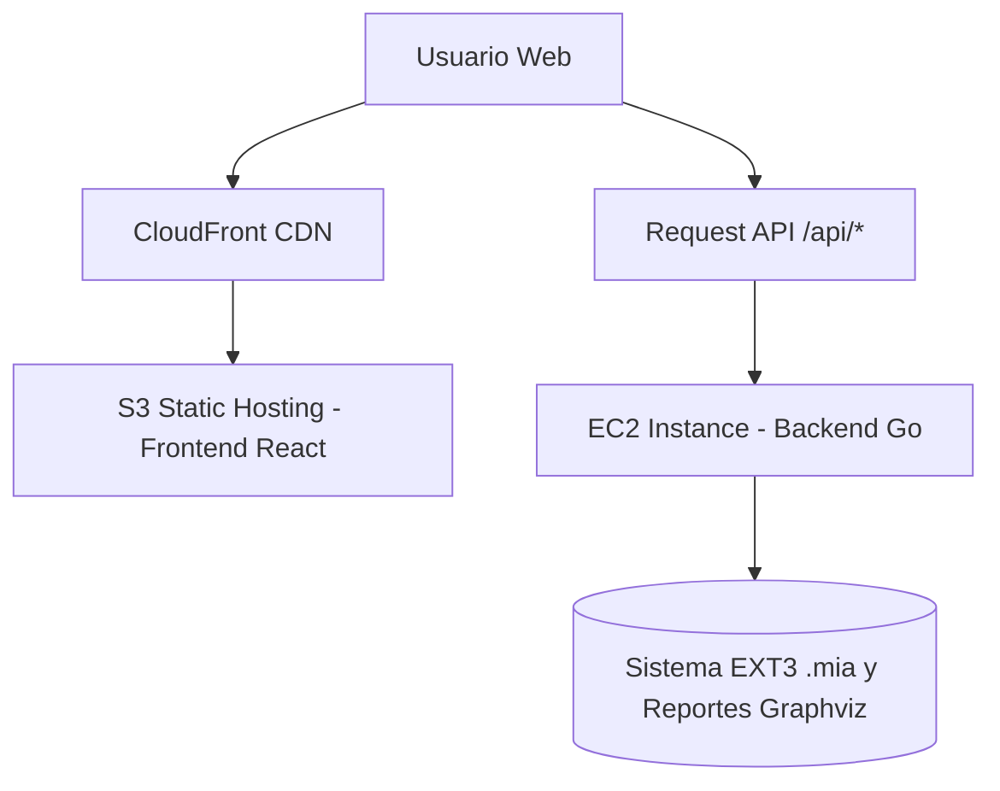
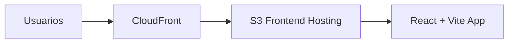

# Universidad de San Carlos de Guatemala

## Facultad de Ingeniería

### Escuela de Ciencias y Sistemas

#### Laboratorio de Manejo e Implementación de Archivos

---

# **Despliegue en AWS – GoDisk 2.0**

### Sistema de Archivos EXT2 / EXT3 con Arquitectura Cloud

**Autor:** Julian Reyes
**Carnet:** 201905884
**Segundo Semestre 2025**

---

## 📘 Índice

- [Universidad de San Carlos de Guatemala](#universidad-de-san-carlos-de-guatemala)
  - [Facultad de Ingeniería](#facultad-de-ingeniería)
    - [Escuela de Ciencias y Sistemas](#escuela-de-ciencias-y-sistemas)
      - [Laboratorio de Manejo e Implementación de Archivos](#laboratorio-de-manejo-e-implementación-de-archivos)
- [**Despliegue en AWS – GoDisk 2.0**](#despliegue-en-aws--godisk-20)
    - [Sistema de Archivos EXT2 / EXT3 con Arquitectura Cloud](#sistema-de-archivos-ext2--ext3-con-arquitectura-cloud)
  - [📘 Índice](#-índice)
  - [🔹 Introducción](#-introducción)
  - [🎯 Objetivo del Despliegue](#-objetivo-del-despliegue)
  - [☁️ Arquitectura Cloud Implementada](#️-arquitectura-cloud-implementada)
    - [Descripción general](#descripción-general)
  - [🗂️ Configuración del Frontend en S3](#️-configuración-del-frontend-en-s3)
    - [Pasos de implementación](#pasos-de-implementación)
  - [💻 Configuración del Backend en EC2](#-configuración-del-backend-en-ec2)
    - [Pasos de implementación](#pasos-de-implementación-1)
  - [🌐 Integración con CloudFront](#-integración-con-cloudfront)
    - [Configuración](#configuración)
  - [🔒 Seguridad y Políticas IAM](#-seguridad-y-políticas-iam)
  - [⚙️ Configuración del Proxy en Vite](#️-configuración-del-proxy-en-vite)
  - [🧪 Pruebas de Funcionamiento](#-pruebas-de-funcionamiento)
    - [1️⃣ Prueba de Conexión Backend](#1️⃣-prueba-de-conexión-backend)
    - [2️⃣ Ejecución de comandos](#2️⃣-ejecución-de-comandos)
    - [3️⃣ Generación de reportes](#3️⃣-generación-de-reportes)
  - [🧾 Conclusiones](#-conclusiones)

---

## 🔹 Introducción

El proyecto **GoDisk 2.0** fue desplegado en la nube de **Amazon Web Services (AWS)** con el propósito de permitir el acceso remoto, la disponibilidad 24/7 y la demostración en un entorno productivo.

El despliegue combina los servicios **AWS S3 (hosting estático)**, **AWS EC2 (backend API)** y **CloudFront (distribución CDN)**, formando una arquitectura híbrida que mantiene el backend operativo sobre una instancia Linux y el frontend accesible públicamente a través de la web.

---

## 🎯 Objetivo del Despliegue

* Permitir el acceso remoto a la interfaz web de GoDisk 2.0.
* Asegurar comunicación estable entre frontend y backend mediante HTTPS.
* Implementar prácticas básicas de DevOps con almacenamiento, cómputo y red.
* Demostrar la escalabilidad del proyecto integrando infraestructura cloud real.

---

## ☁️ Arquitectura Cloud Implementada

La infraestructura se construye sobre tres servicios principales: **S3**, **EC2** y **CloudFront**, representados a continuación:



### Descripción general

| Servicio            | Rol en el Sistema                          | Características principales                   |
| ------------------- | ------------------------------------------ | --------------------------------------------- |
| **S3**              | Almacena y sirve los archivos del frontend | Escalable, sin servidor, bajo costo           |
| **CloudFront**      | CDN que distribuye el contenido            | HTTPS, baja latencia, seguridad               |
| **EC2**             | Servidor para el backend Go                | Permite ejecución continua de la API          |
| **Security Groups** | Control de tráfico entrante/saliente       | Asegura puertos 80 y 8080                     |
| **IAM Roles**       | Asigna permisos limitados                  | Acceso restringido solo al servicio necesario |

---

## 🗂️ Configuración del Frontend en S3

El **frontend** fue desarrollado en React y compilado con Vite.
Los archivos estáticos (`index.html`, `assets/`) se subieron al bucket S3 configurado como sitio web estático.

### Pasos de implementación

1. **Compilar proyecto:**

   ```bash
   npm run build
   ```

   Esto genera la carpeta `/dist`.

2. **Crear bucket S3:**

   * Nombre: `frontend-mia-201905884`
   * Región: `us-east-2`
   * Configuración: “Bloquear acceso público: DESACTIVADO”.

3. **Subir archivos:**

   ```bash
   aws s3 sync ./dist s3://frontend-mia-201905884
   ```

4. **Habilitar hosting estático:**

   * Página de inicio: `index.html`
   * Página de error: `index.html` (para SPA).

5. **Configurar política pública:**

   ```json
   {
     "Version": "2012-10-17",
     "Statement": [
       {
         "Sid": "PublicReadGetObject",
         "Effect": "Allow",
         "Principal": "*",
         "Action": "s3:GetObject",
         "Resource": "arn:aws:s3:::frontend-mia-201905884/*"
       }
     ]
   }
   ```

✅ **Resultado:**
El frontend queda disponible públicamente en:
`https://frontend-mia-201905884.s3-website.us-east-2.amazonaws.com`

---

## 💻 Configuración del Backend en EC2

El **backend** se ejecuta en una instancia EC2 con sistema operativo **Amazon Linux 2**.

### Pasos de implementación

1. **Crear instancia EC2**

   * Tipo: `t2.micro` (Free Tier)
   * Sistema operativo: `Amazon Linux 2`
   * Grupo de seguridad: permitir tráfico en puertos `22`, `80`, `8080`.

2. **Conectarse por SSH**

   ```bash
   ssh -i "keypair.pem" ec2-user@ec2-xx-xx-xx-xx.us-east-2.compute.amazonaws.com
   ```

3. **Instalar dependencias**

   ```bash
   sudo yum update -y
   sudo yum install git golang -y
   ```

4. **Clonar repositorio y ejecutar**

   ```bash
   git clone https://github.com/Santiago78op/MIA_2S2025_P1_201905884.git
   cd Backend/cmd/server
   go run .
   ```

5. **Configurar proceso persistente**

   ```bash
   nohup go run . > server.log 2>&1 &
   ```

✅ **Backend activo en:**
`http://ec2-xx-xx-xx-xx.us-east-2.compute.amazonaws.com:8080/api/*`

---

## 🌐 Integración con CloudFront

CloudFront se usa como **CDN** para distribuir el frontend con mejor latencia y seguridad HTTPS.



### Configuración

1. Crear distribución CloudFront.
2. Seleccionar el bucket S3 como origen.
3. Habilitar HTTPS automático (certificado ACM).
4. Configurar comportamiento de caché para `/api/*` con proxy hacia EC2.

---

## 🔒 Seguridad y Políticas IAM

Se aplicaron políticas IAM mínimas necesarias:

| Recurso              | Permisos                             |
| -------------------- | ------------------------------------ |
| **S3 Bucket**        | `s3:GetObject`, `s3:ListBucket`      |
| **CloudFront**       | `cloudfront:CreateInvalidation`      |
| **EC2 Instance**     | Acceso SSH restringido a IP local    |
| **IAM Role Backend** | Solo ejecución y lectura de recursos |

Además, se bloquearon permisos de escritura pública para evitar modificaciones al código fuente.

---

## ⚙️ Configuración del Proxy en Vite

Para que el frontend comunique correctamente con la API del backend desplegado, se configuró un **proxy** en el archivo `vite.config.js`:

```javascript
// vite.config.js
import { defineConfig } from "vite";
import react from "@vitejs/plugin-react";

export default defineConfig({
  plugins: [react()],
  server: {
    proxy: {
      "/api": "http://ec2-xx-xx-xx-xx.us-east-2.compute.amazonaws.com:8080",
    },
  },
});
```

📌 **Importante:**
En producción (AWS S3), este proxy se sustituye por una URL absoluta de API para asegurar comunicación directa.

---

## 🧪 Pruebas de Funcionamiento

### 1️⃣ Prueba de Conexión Backend

```bash
curl http://ec2-xx-xx-xx-xx.us-east-2.compute.amazonaws.com:8080/health
```

**Respuesta esperada:**

```json
{"status": "ok"}
```

### 2️⃣ Ejecución de comandos

Desde el frontend, ingresar:

```
mkdisk -size=10 -unit=M -path="/home/ec2-user/Disco1.mia"
```

Deberá mostrarse:

```
[✔] Disco creado exitosamente en /home/ec2-user/Disco1.mia
```

### 3️⃣ Generación de reportes

```
rep -id=841A -path=/home/ec2-user/reports/reporte1.jpg -name=mbr
```

El archivo generado se guarda en el backend dentro del directorio `/Reports`.

---

## 🧾 Conclusiones

* El despliegue en **AWS** permitió llevar el sistema a un entorno de producción real, asegurando accesibilidad y demostración pública.
* **S3** proporciona un hosting rápido y económico para el frontend, mientras que **EC2** asegura la ejecución continua del backend.
* **CloudFront** mejora el rendimiento y añade una capa de seguridad HTTPS.
* La integración de estas tecnologías representa un ejemplo funcional de infraestructura **full-stack cloud** aplicable a proyectos académicos y empresariales.
* El sistema GoDisk 2.0 demuestra la capacidad de combinar simulación de bajo nivel (sistemas de archivos) con despliegue web moderno.
