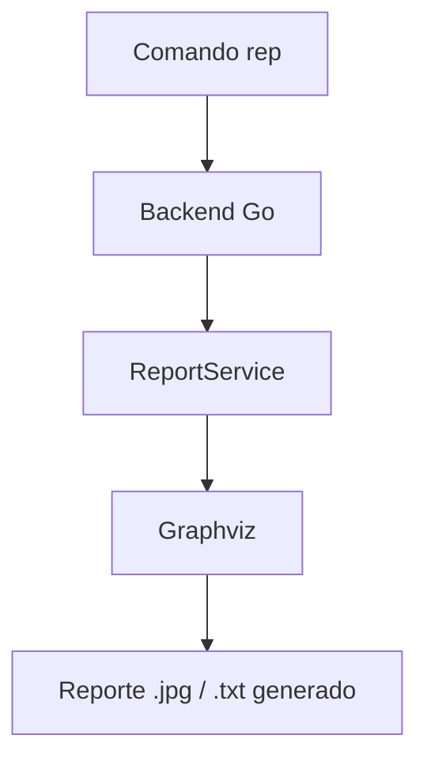
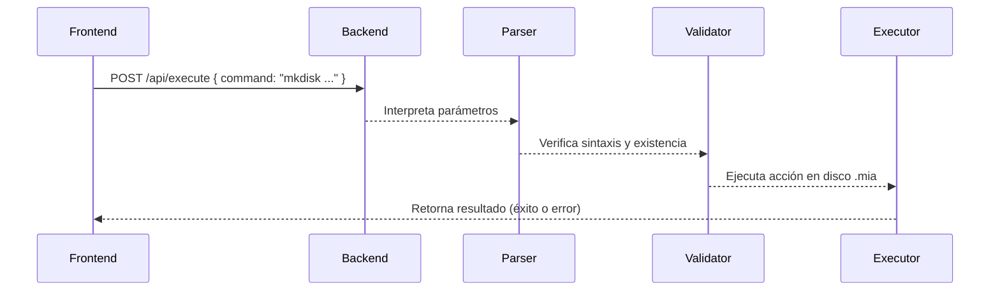

# Universidad de San Carlos de Guatemala

## Facultad de Ingeniería

### Escuela de Ciencias y Sistemas

#### Laboratorio de Manejo e Implementación de Archivos

---

# **Comandos Implementados – GoDisk 2.0**

### Sistema de Archivos EXT2 / EXT3 con Despliegue AWS

**Autor:** Julian Reyes
**Carnet:** 201905884
**Segundo Semestre 2025**

---

## 📘 Índice

- [Universidad de San Carlos de Guatemala](#universidad-de-san-carlos-de-guatemala)
  - [Facultad de Ingeniería](#facultad-de-ingeniería)
    - [Escuela de Ciencias y Sistemas](#escuela-de-ciencias-y-sistemas)
      - [Laboratorio de Manejo e Implementación de Archivos](#laboratorio-de-manejo-e-implementación-de-archivos)
- [**Comandos Implementados – GoDisk 2.0**](#comandos-implementados--godisk-20)
    - [Sistema de Archivos EXT2 / EXT3 con Despliegue AWS](#sistema-de-archivos-ext2--ext3-con-despliegue-aws)
  - [📘 Índice](#-índice)
  - [🔹 Introducción](#-introducción)
  - [🧩 Estructura General de los Comandos](#-estructura-general-de-los-comandos)
  - [💽 Comandos de Administración de Discos](#-comandos-de-administración-de-discos)
    - [1️⃣ MKDISK](#1️⃣-mkdisk)
    - [2️⃣ RMDISK](#2️⃣-rmdisk)
    - [3️⃣ FDISK](#3️⃣-fdisk)
  - [🧷 Comandos de Montaje](#-comandos-de-montaje)
    - [4️⃣ MOUNT](#4️⃣-mount)
    - [5️⃣ MOUNTED](#5️⃣-mounted)
  - [🧮 Comandos del Sistema de Archivos](#-comandos-del-sistema-de-archivos)
    - [6️⃣ MKFS](#6️⃣-mkfs)
    - [7️⃣ CAT](#7️⃣-cat)
  - [👥 Comandos de Usuarios y Grupos](#-comandos-de-usuarios-y-grupos)
  - [📂 Comandos de Archivos y Carpetas](#-comandos-de-archivos-y-carpetas)
  - [📊 Comando de Reportes](#-comando-de-reportes)
  - [🔄 Flujo Interno de Ejecución](#-flujo-interno-de-ejecución)
  - [🧾 Conclusiones](#-conclusiones)

---

## 🔹 Introducción

Los comandos son el mecanismo mediante el cual el usuario interactúa con el **sistema de archivos simulado**.
Cada comando se interpreta, valida y ejecuta a través del **CommandRunner** en el backend, que procesa el texto recibido desde el frontend y aplica los cambios directamente sobre el archivo binario `.mia`.

Todos los comandos implementados cumplen la sintaxis y parámetros establecidos en el **enunciado oficial del curso MIA (USAC, 2S2025)**, garantizando consistencia y compatibilidad con las estructuras del sistema **EXT2/EXT3**.

---

## 🧩 Estructura General de los Comandos

```bash
comando -parametro1=valor -parametro2=valor -parametroN=valor
```

* Los parámetros pueden ingresarse en cualquier orden.
* Los valores con espacios deben ir entre comillas `" "`.
* No distingue entre mayúsculas y minúsculas.
* El backend valida los tipos de datos, rutas y existencia de archivos.

Ejemplo:

```bash
mkdisk -size=10 -unit=M -path="/home/julian/Disco1.mia"
```

---

## 💽 Comandos de Administración de Discos

### 1️⃣ MKDISK

Crea un nuevo archivo `.mia` que simula un disco duro virtual.

| Parámetro | Tipo        | Descripción                                               |
| --------- | ----------- | --------------------------------------------------------- |
| `-size`   | Obligatorio | Tamaño del disco en unidades especificadas.               |
| `-unit`   | Opcional    | `K` = Kilobytes / `M` = Megabytes. Por defecto `M`.       |
| `-fit`    | Opcional    | Ajuste de partición (`BF`, `FF`, `WF`). Por defecto `FF`. |
| `-path`   | Obligatorio | Ruta absoluta donde se creará el archivo.                 |

**Ejemplo:**

```bash
mkdisk -size=5 -unit=M -fit=FF -path="/home/user/Disco1.mia"
```

📄 **Descripción técnica:**

* Crea un archivo binario de tamaño fijo.
* Escribe un **MBR** inicializado con 0s.
* Genera un número aleatorio como `dsk_signature`.

---

### 2️⃣ RMDISK

Elimina un archivo `.mia` existente.

| Parámetro | Tipo        | Descripción                           |
| --------- | ----------- | ------------------------------------- |
| `-path`   | Obligatorio | Ruta absoluta del archivo a eliminar. |

**Ejemplo:**

```bash
rmdisk -path="/home/user/Disco1.mia"
```

🧩 **Acción interna:**
El backend valida la existencia del archivo y lo elimina del sistema, actualizando los registros en memoria.

---

### 3️⃣ FDISK

Administra particiones dentro de un disco.

| Parámetro | Tipo                   | Descripción                                    |
| --------- | ---------------------- | ---------------------------------------------- |
| `-size`   | Obligatorio (al crear) | Tamaño de la partición.                        |
| `-unit`   | Opcional               | `B`, `K`, `M` (por defecto `K`).               |
| `-path`   | Obligatorio            | Ruta del disco existente.                      |
| `-type`   | Opcional               | `P` = Primaria, `E` = Extendida, `L` = Lógica. |
| `-fit`    | Opcional               | Tipo de ajuste (`BF`, `FF`, `WF`).             |
| `-name`   | Obligatorio            | Nombre de la partición.                        |

**Ejemplo:**

```bash
fdisk -size=100 -unit=K -path="/home/user/Disco1.mia" -name=Part1 -type=P -fit=BF
```

⚙️ **Acción interna:**

* Busca el primer espacio disponible según el ajuste.
* Si el tipo es `E`, crea una **partición extendida** y un **EBR** inicial.
* Si es `L`, se agrega dentro del espacio extendido.

---

## 🧷 Comandos de Montaje

### 4️⃣ MOUNT

Monta una partición en memoria y le asigna un ID único.

| Parámetro | Tipo        | Descripción             |
| --------- | ----------- | ----------------------- |
| `-path`   | Obligatorio | Ruta del disco.         |
| `-name`   | Obligatorio | Nombre de la partición. |

**Ejemplo:**

```bash
mount -path="/home/user/Disco1.mia" -name=Part1
```

🔹 **Resultado:**
Se genera un ID como `841A`, usado en comandos posteriores (`mkfs`, `login`, etc.).

---

### 5️⃣ MOUNTED

Muestra todas las particiones montadas actualmente.

**Ejemplo:**

```bash
mounted
```

📋 **Salida esperada:**

```
841A -> /home/user/Disco1.mia (Part1)
841B -> /home/user/Disco1.mia (Part2)
```

---

## 🧮 Comandos del Sistema de Archivos

### 6️⃣ MKFS

Formatea una partición montada y genera las estructuras EXT2 o EXT3.

| Parámetro | Tipo        | Descripción             |
| --------- | ----------- | ----------------------- |
| `-id`     | Obligatorio | ID asignado en `mount`. |
| `-type`   | Opcional    | `full` (por defecto).   |

**Ejemplo:**

```bash
mkfs -id=841A -type=full
```

📄 **Acción interna:**

* Inicializa **SuperBloque, Bitmaps, Inodos y Bloques**.
* Crea el archivo lógico `users.txt` con usuario `root`.
* Define la cantidad de estructuras según el tamaño de la partición.

---

### 7️⃣ CAT

Muestra el contenido de archivos dentro del sistema.

| Parámetro               | Tipo        | Descripción                      |
| ----------------------- | ----------- | -------------------------------- |
| `-file1`, `-file2`, ... | Obligatorio | Rutas de los archivos a mostrar. |

**Ejemplo:**

```bash
cat -file1="/home/docs/a.txt" -file2="/home/docs/b.txt"
```

📌 **Acción interna:**
Concatena y muestra el contenido de los archivos solicitados en el área de salida del frontend.

---

## 👥 Comandos de Usuarios y Grupos

Estos comandos administran el archivo `users.txt` creado en el formateo inicial del sistema.

| Comando  | Función                                 | Ejemplo                                    |
| -------- | --------------------------------------- | ------------------------------------------ |
| `login`  | Inicia sesión en una partición montada. | `login -user=root -pass=123 -id=841A`      |
| `logout` | Cierra la sesión actual.                | `logout`                                   |
| `mkgrp`  | Crea un grupo nuevo.                    | `mkgrp -name=usuarios`                     |
| `rmgrp`  | Elimina un grupo existente.             | `rmgrp -name=usuarios`                     |
| `mkusr`  | Crea un nuevo usuario.                  | `mkusr -user=alex -pass=123 -grp=usuarios` |
| `rmusr`  | Elimina un usuario existente.           | `rmusr -user=alex`                         |
| `chgrp`  | Cambia el grupo de un usuario.          | `chgrp -user=alex -grp=admin`              |

📄 Todos estos comandos son válidos **solo si existe una sesión activa** (`login`).

---

## 📂 Comandos de Archivos y Carpetas

| Comando  | Descripción                       | Ejemplo                                               |
| -------- | --------------------------------- | ----------------------------------------------------- |
| `mkdir`  | Crea carpetas dentro del sistema. | `mkdir -p -path=/home/user/docs`                      |
| `mkfile` | Crea archivos con contenido.      | `mkfile -size=15 -path="/home/user/docs/info.txt" -r` |

🔹 **Parámetros relevantes:**

* `-p`: crea carpetas padres si no existen.
* `-r`: crea la ruta automáticamente.
* `-size`: tamaño del archivo en bytes.
* `-cont`: carga contenido desde un archivo del sistema real.

---

## 📊 Comando de Reportes

El comando `rep` genera representaciones gráficas del estado del sistema de archivos.

| Parámetro       | Tipo        | Descripción                                                            |
| --------------- | ----------- | ---------------------------------------------------------------------- |
| `-id`           | Obligatorio | ID de partición montada.                                               |
| `-path`         | Obligatorio | Ruta destino del reporte.                                              |
| `-name`         | Obligatorio | Tipo de reporte (`mbr`, `disk`, `inode`, `block`, `sb`, `tree`, `ls`). |
| `-path_file_ls` | Opcional    | Ruta de archivo o carpeta específica.                                  |

**Ejemplo:**

```bash
rep -id=841A -path="/home/reports/reporte1.jpg" -name=mbr
rep -id=841A -path="/home/reports/reporte2.jpg" -name=tree
```

📈 **Flujo general de generación:**



---

## 🔄 Flujo Interno de Ejecución



Cada comando pasa por las siguientes etapas:

1. **Recepción:** desde el frontend.
2. **Parseo:** identificación de comando y parámetros.
3. **Validación:** revisión de errores y sintaxis.
4. **Ejecución:** llamada al método correspondiente.
5. **Respuesta:** devolución del mensaje al usuario.

---

## 🧾 Conclusiones

* Los comandos constituyen la interfaz funcional entre el usuario y el sistema de archivos.
* Cada comando replica las operaciones reales del sistema EXT2/EXT3.
* La ejecución secuencial de comandos permite simular procesos de formateo, administración y visualización de datos.
* La implementación en Go mediante un intérprete propio garantiza la fidelidad al comportamiento de un sistema operativo real.
* Los reportes generados por **Graphviz** validan visualmente las operaciones ejecutadas.

