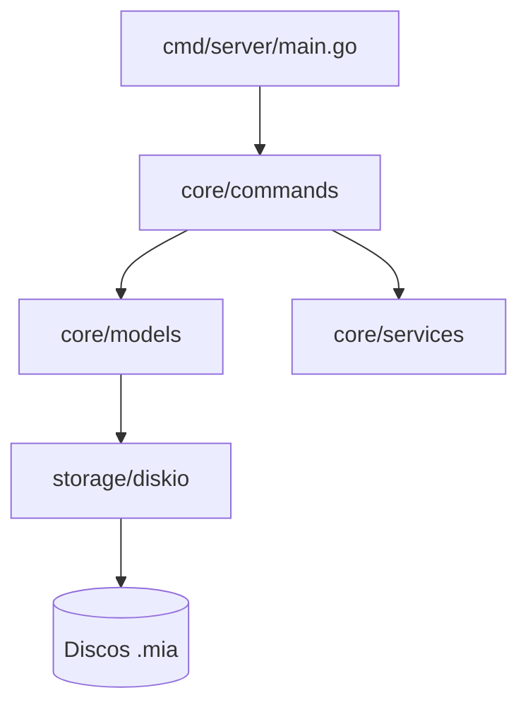
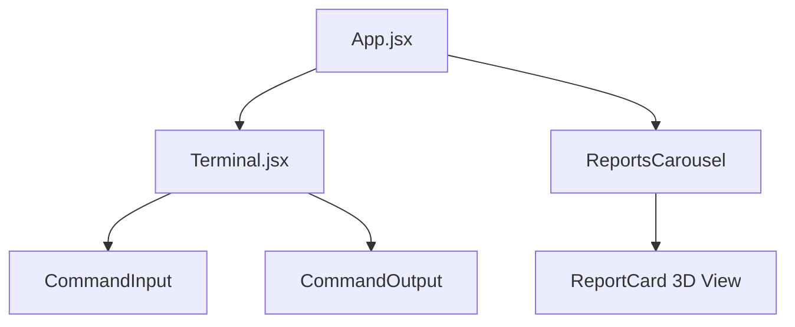
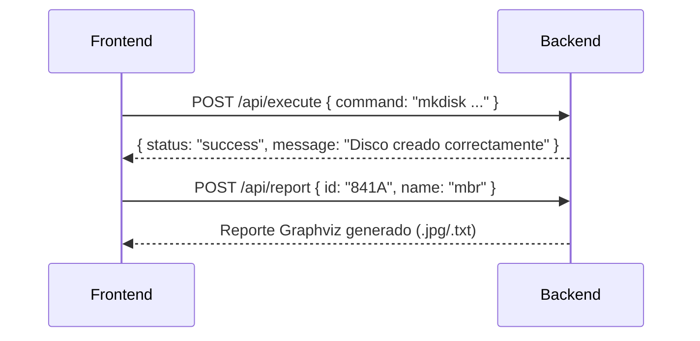
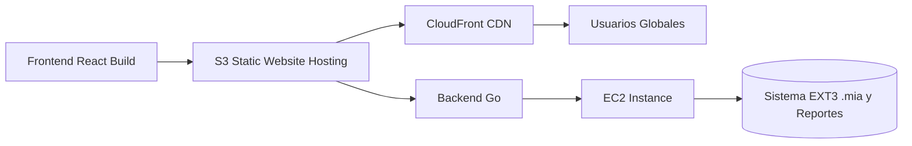

# Universidad de San Carlos de Guatemala

## Facultad de Ingeniería

### Escuela de Ciencias y Sistemas

#### Laboratorio de Manejo e Implementación de Archivos

---

# **Arquitectura del Sistema – GoDisk 2.0**

### Sistema de Archivos EXT2 / EXT3 con Despliegue AWS

**Autor:** Julian Reyes
**Carnet:** 201905884
**Segundo Semestre 2025**

---

## 📘 Índice

1. [Introducción](#introducción)
2. [Diseño General del Sistema](#diseño-general-del-sistema)
3. [Arquitectura del Backend](#arquitectura-del-backend)
4. [Arquitectura del Frontend](#arquitectura-del-frontend)
5. [Comunicación Frontend–Backend](#comunicación-frontend–backend)
6. [Arquitectura del Despliegue AWS](#arquitectura-del-despliegue-aws)
7. [Conclusiones](#conclusiones)

---

## 🔹 Introducción

La arquitectura de **GoDisk 2.0** fue diseñada bajo una estructura modular que integra la simulación de un sistema de archivos tipo **EXT2/EXT3** en el backend desarrollado con **Go**, una interfaz web moderna creada con **React + Vite**, y un despliegue productivo mediante **AWS S3 + EC2**.

El propósito de esta arquitectura es lograr la **separación de responsabilidades**, la **portabilidad del sistema** y la **escalabilidad en la nube**, manteniendo la ejecución eficiente de operaciones a nivel de disco binario `.mia`.

---

## 🧠 Diseño General del Sistema

El sistema se organiza en tres capas principales:

```mermaid
graph TD
    A[Frontend React/Vite] --> B[Backend Go (Gin Framework)]
    B --> C[Simulación EXT2/EXT3 (.mia)]
    B --> D[Graphviz - Generación de Reportes]
    A --> E[(AWS S3 - Hosting Estático)]
    E --> F[(CloudFront CDN)]
    F --> G[Usuario Final]
```

### Capas Principales

| Capa                | Tecnología                  | Función                                       |
| ------------------- | --------------------------- | --------------------------------------------- |
| **Frontend**        | React + TypeScript + Vite   | Interfaz web y ejecución de comandos.         |
| **Backend**         | Go (Gin, JSON, I/O binario) | Simulación del sistema de archivos EXT2/EXT3. |
| **Infraestructura** | AWS S3, EC2 y CloudFront    | Despliegue del sistema en la nube.            |

---

## ⚙️ Arquitectura del Backend

El backend está desarrollado en **Go**, estructurado bajo el patrón **Clean Architecture**, separando la lógica de negocio, controladores y servicios.



### Estructura de carpetas

```
Backend/
├── cmd/
│   └── server/              # Punto de entrada principal
├── core/
│   ├── commands/            # Lógica de ejecución de comandos
│   ├── models/              # Estructuras MBR, EBR, SuperBloque, etc.
│   └── services/            # Servicios auxiliares (Reportes, Auth, etc.)
├── storage/
│   └── diskio/              # Manejo de archivos binarios (.mia)
└── reports/                 # Carpeta de reportes Graphviz
```

### Principales componentes

| Módulo               | Función                                                     |
| -------------------- | ----------------------------------------------------------- |
| **CommandRunner**    | Ejecuta comandos individuales enviados desde el frontend.   |
| **ScriptRunner**     | Interpreta archivos `.smia` con múltiples comandos.         |
| **ReportService**    | Genera reportes gráficos con Graphviz.                      |
| **FileFsRepository** | Maneja operaciones sobre discos, particiones y estructuras. |

---

## 🖥️ Arquitectura del Frontend

El frontend fue implementado con **React + Vite + TailwindCSS**, brindando una interfaz responsiva, moderna y adaptable.



### Estructura general

```
Frontend/
├── src/
│   ├── components/
│   │   ├── Terminal.jsx        # Área de comandos
│   │   ├── CommandInput.jsx    # Entrada de texto
│   │   ├── CommandOutput.jsx   # Resultados y logs
│   │   └── ReportsCarousel.jsx # Visualización de reportes
│   ├── assets/
│   └── main.jsx
├── vite.config.js              # Configuración con proxy API
└── .env                        # Variables de entorno (API_URL)
```

### Funcionalidades principales

* **Terminal interactiva** para enviar comandos y scripts.
* **Renderizado en tiempo real** de reportes generados por Graphviz.
* **Carrusel 3D** con tarjetas visuales de los reportes (`mbr`, `disk`, `inode`, `tree`, etc.).
* **Animaciones CSS y Flexbox** para diseño adaptable.

---

## 🔄 Comunicación Frontend–Backend

El intercambio entre ambos módulos se realiza mediante **API REST** con respuestas en formato JSON.



### Ejemplo de flujo de petición

**Frontend (React):**

```javascript
await fetch("http://localhost:8080/api/execute", {
  method: "POST",
  headers: { "Content-Type": "application/json" },
  body: JSON.stringify({ command: inputCommand })
});
```

**Backend (Go):**

```go
func ExecuteCommand(c *gin.Context) {
    var req CommandRequest
    c.BindJSON(&req)
    output := command.Run(req.Command)
    c.JSON(http.StatusOK, gin.H{"output": output})
}
```

---

## ☁️ Arquitectura del Despliegue AWS

El proyecto se implementó bajo una arquitectura híbrida **Frontend + Backend** en AWS:



### Componentes AWS

| Servicio            | Función                                                |
| ------------------- | ------------------------------------------------------ |
| **S3**              | Aloja el frontend compilado (`index.html`, `assets/`). |
| **CloudFront**      | Distribuye el contenido globalmente con baja latencia. |
| **EC2**             | Ejecuta el backend en Go (puerto 8080).                |
| **Security Groups** | Controlan acceso HTTPS y API.                          |

### Configuración del Proxy

Para redirigir correctamente las peticiones:

```js
// vite.config.js
export default defineConfig({
  server: {
    proxy: {
      '/api': 'http://ec2-xx-xx-xx-xx.compute.amazonaws.com:8080'
    }
  }
});
```

---

## 🧾 Conclusiones

* La arquitectura de GoDisk 2.0 cumple con principios de modularidad, separación de capas y escalabilidad.
* El uso de **Go** permite alto rendimiento y manejo eficiente de archivos binarios.
* El **frontend React** proporciona una experiencia visual moderna e interactiva.
* El **despliegue en AWS** garantiza disponibilidad, accesibilidad y demostración práctica de un entorno de producción.
* En conjunto, la arquitectura constituye un ejemplo funcional de integración **full-stack** entre sistemas locales y servicios en la nube.
* 
