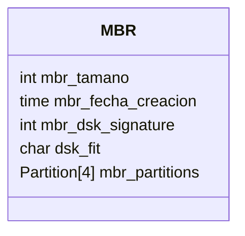
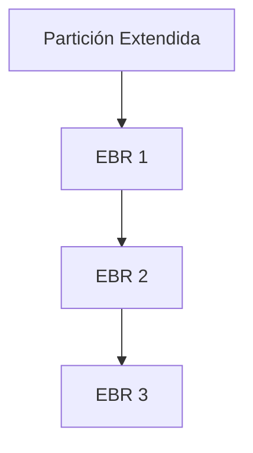
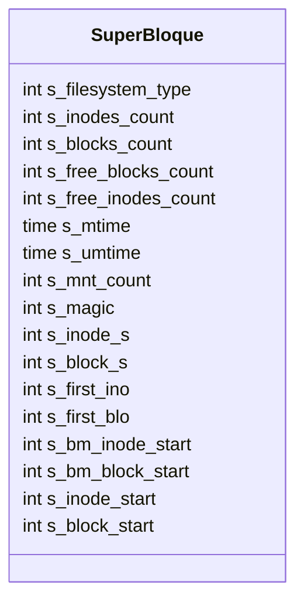
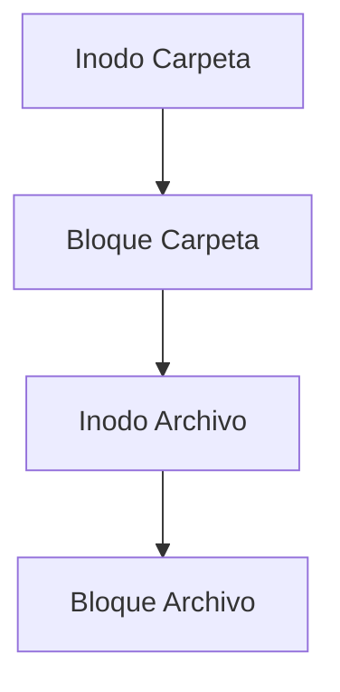
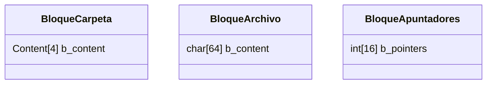

# Universidad de San Carlos de Guatemala

## Facultad de Ingeniería

### Escuela de Ciencias y Sistemas

#### Laboratorio de Manejo e Implementación de Archivos

---

# **Estructuras del Sistema de Archivos – GoDisk 2.0**

### Sistema EXT2 / EXT3 con Despliegue AWS

**Autor:** Julian Reyes
**Carnet:** 201905884
**Segundo Semestre 2025**

---

## 📘 Índice

- [Universidad de San Carlos de Guatemala](#universidad-de-san-carlos-de-guatemala)
  - [Facultad de Ingeniería](#facultad-de-ingeniería)
    - [Escuela de Ciencias y Sistemas](#escuela-de-ciencias-y-sistemas)
      - [Laboratorio de Manejo e Implementación de Archivos](#laboratorio-de-manejo-e-implementación-de-archivos)
- [**Estructuras del Sistema de Archivos – GoDisk 2.0**](#estructuras-del-sistema-de-archivos--godisk-20)
    - [Sistema EXT2 / EXT3 con Despliegue AWS](#sistema-ext2--ext3-con-despliegue-aws)
  - [📘 Índice](#-índice)
  - [🔹 Introducción](#-introducción)
  - [🧭 Jerarquía General del Sistema de Archivos](#-jerarquía-general-del-sistema-de-archivos)
  - [🧱 Estructura MBR (Master Boot Record)](#-estructura-mbr-master-boot-record)
  - [💾 Estructura de Partición y EBR](#-estructura-de-partición-y-ebr)
    - [Estructura `Partition`](#estructura-partition)
    - [Estructura `EBR` (Extended Boot Record)](#estructura-ebr-extended-boot-record)
  - [🧮 SuperBloque (Superblock)](#-superbloque-superblock)
  - [📂 Inodos](#-inodos)
  - [🧱 Bloques](#-bloques)
    - [Tipos de Bloques](#tipos-de-bloques)
  - [🔢 Bitmaps](#-bitmaps)
    - [Ejemplo](#ejemplo)
  - [⚖️ Comparación EXT2 vs EXT3](#️-comparación-ext2-vs-ext3)
  - [🧾 Conclusiones](#-conclusiones)

---

## 🔹 Introducción

Las **estructuras de datos** son el núcleo funcional del sistema de archivos **GoDisk 2.0**.
A través de ellas se simula el comportamiento de un sistema EXT2/EXT3, permitiendo administrar **discos virtuales**, **particiones**, **bloques de datos** y **usuarios**.

El propósito de esta documentación es describir de manera técnica y visual el funcionamiento de las estructuras que conforman el sistema de archivos binario `.mia`.

---

## 🧭 Jerarquía General del Sistema de Archivos

La organización de las estructuras sigue el orden físico en el archivo binario `.mia`.

```mermaid
graph TD
    A[Disco (.mia)] --> B[MBR]
    B --> C[Particiones]
    C --> D[EBR (si existen lógicas)]
    D --> E[SuperBloque]
    E --> F[Bitmap de Inodos]
    F --> G[Bitmap de Bloques]
    G --> H[Tabla de Inodos]
    H --> I[Tabla de Bloques]
```

Cada nivel cumple una función específica para la administración del almacenamiento.

---

## 🧱 Estructura MBR (Master Boot Record)

El **MBR** es la estructura principal del disco.
Se encuentra en el primer sector del archivo `.mia` y contiene la información básica del disco y las particiones.

| Campo                  | Tipo         | Descripción                               |
| ---------------------- | ------------ | ----------------------------------------- |
| **mbr_tamano**         | int          | Tamaño total del disco (bytes)            |
| **mbr_fecha_creacion** | time         | Fecha de creación                         |
| **mbr_dsk_signature**  | int          | Identificador único del disco             |
| **dsk_fit**            | char         | Tipo de ajuste (B=Best, F=First, W=Worst) |
| **mbr_partitions**     | [4]Partition | Arreglo de particiones                    |



📌 El MBR permite hasta **cuatro particiones primarias o extendidas**, garantizando compatibilidad con la teoría de particiones.

---

## 💾 Estructura de Partición y EBR

Las **particiones** son divisiones lógicas del disco.
Existen tres tipos: **Primarias, Extendidas y Lógicas**.

### Estructura `Partition`

| Campo            | Tipo     | Descripción              |
| ---------------- | -------- | ------------------------ |
| part_status      | char     | Estado (activa/inactiva) |
| part_type        | char     | Tipo (P/E)               |
| part_fit         | char     | Tipo de ajuste           |
| part_start       | int      | Byte de inicio           |
| part_s           | int      | Tamaño (bytes)           |
| part_name        | char[16] | Nombre                   |
| part_correlative | int      | ID correlativo           |
| part_id          | char[4]  | Identificador de montaje |

### Estructura `EBR` (Extended Boot Record)

El **EBR** administra las **particiones lógicas** dentro de una extendida.
Funciona como una **lista enlazada** dentro del espacio extendido.

| Campo      | Tipo     | Descripción                   |
| ---------- | -------- | ----------------------------- |
| part_mount | char     | Indica si está montada        |
| part_fit   | char     | Tipo de ajuste                |
| part_start | int      | Byte inicial                  |
| part_s     | int      | Tamaño de la unidad lógica    |
| part_next  | int      | Byte del siguiente EBR        |
| part_name  | char[16] | Nombre de la partición lógica |



---

## 🧮 SuperBloque (Superblock)

El **SuperBloque** es la estructura maestra del sistema de archivos.
Contiene información sobre el tipo de sistema, número de estructuras y ubicaciones de inicio.

| Campo               | Tipo | Descripción                     |
| ------------------- | ---- | ------------------------------- |
| s_filesystem_type   | int  | Tipo de FS (2 = EXT2, 3 = EXT3) |
| s_inodes_count      | int  | Número total de inodos          |
| s_blocks_count      | int  | Número total de bloques         |
| s_free_blocks_count | int  | Bloques libres                  |
| s_free_inodes_count | int  | Inodos libres                   |
| s_mtime             | time | Último montaje                  |
| s_umtime            | time | Último desmontaje               |
| s_mnt_count         | int  | Veces montado                   |
| s_magic             | int  | Identificador 0xEF53            |
| s_inode_s           | int  | Tamaño del inodo                |
| s_block_s           | int  | Tamaño del bloque               |
| s_first_ino         | int  | Primer inodo libre              |
| s_first_blo         | int  | Primer bloque libre             |
| s_bm_inode_start    | int  | Inicio del bitmap de inodos     |
| s_bm_block_start    | int  | Inicio del bitmap de bloques    |
| s_inode_start       | int  | Inicio de tabla de inodos       |
| s_block_start       | int  | Inicio de tabla de bloques      |



---

## 📂 Inodos

Los **inodos (index nodes)** contienen información sobre archivos y carpetas, incluyendo permisos, propietario, tamaño y apuntadores a bloques.

| Campo   | Tipo    | Descripción                       |
| ------- | ------- | --------------------------------- |
| i_uid   | int     | ID de usuario propietario         |
| i_gid   | int     | Grupo propietario                 |
| i_s     | int     | Tamaño del archivo                |
| i_atime | time    | Última lectura                    |
| i_ctime | time    | Fecha de creación                 |
| i_mtime | time    | Última modificación               |
| i_block | int[15] | Apuntadores directos e indirectos |
| i_type  | char    | 0 = Carpeta / 1 = Archivo         |
| i_perm  | char[3] | Permisos UGO (User, Group, Other) |



Los 15 apuntadores de un inodo se dividen en:

* 12 directos
* 1 indirecto simple
* 1 doble indirecto
* 1 triple indirecto

Esto permite que un solo archivo crezca en múltiples niveles jerárquicos.

---

## 🧱 Bloques

Los **bloques** representan las unidades básicas de almacenamiento de datos.
Cada bloque tiene un tamaño fijo de **64 bytes**.

### Tipos de Bloques

| Tipo                   | Contenido  | Descripción                               |
| ---------------------- | ---------- | ----------------------------------------- |
| **Bloque Carpeta**     | content[4] | Referencias a archivos o subcarpetas      |
| **Bloque Archivo**     | char[64]   | Contiene el contenido textual del archivo |
| **Bloque Apuntadores** | int[16]    | Enlaces hacia otros bloques (indirectos)  |



Cada bloque carpeta puede almacenar hasta **4 elementos (archivos o carpetas)**.

---

## 🔢 Bitmaps

Los **bitmaps** son estructuras binarias que representan el estado de ocupación de inodos y bloques.

| Tipo              | Valor | Significado            |
| ----------------- | ----- | ---------------------- |
| Bitmap de Inodos  | 0 / 1 | Inodo libre / ocupado  |
| Bitmap de Bloques | 0 / 1 | Bloque libre / ocupado |

### Ejemplo

```
Bitmap Inodos:  11100100
Bitmap Bloques: 11110000
```

Los bitmaps se actualizan dinámicamente al crear o eliminar archivos.

---

## ⚖️ Comparación EXT2 vs EXT3

| Característica               | EXT2                   | EXT3                              |
| ---------------------------- | ---------------------- | --------------------------------- |
| **Journaling**               | ❌ No posee             | ✅ Incluye bitácora (Journal)      |
| **Velocidad**                | Mayor (sin journaling) | Ligeramente menor                 |
| **Recuperación ante fallos** | Manual                 | Automática                        |
| **Consistencia**             | Baja si ocurre apagado | Alta gracias al journal           |
| **Compatibilidad**           | Base del sistema       | Retrocompatible con EXT2          |
| **Implementación en GoDisk** | Proyecto 1             | Proyecto 2 (con journaling y AWS) |

En GoDisk 2.0, el **journaling** se implementa como una estructura adicional que registra operaciones antes de aplicarlas, asegurando integridad ante errores o apagones.

---

## 🧾 Conclusiones

* Las estructuras implementadas simulan fielmente el funcionamiento de un sistema EXT2/EXT3.
* El uso del **SuperBloque** y los **bitmaps** permite un control eficiente de recursos.
* La jerarquía definida asegura una gestión modular de discos, particiones, inodos y bloques.
* La extensión a EXT3 con **journaling** representa una mejora significativa en seguridad y consistencia.
* Estas estructuras constituyen la base de la simulación de archivos en **GoDisk 2.0**.
