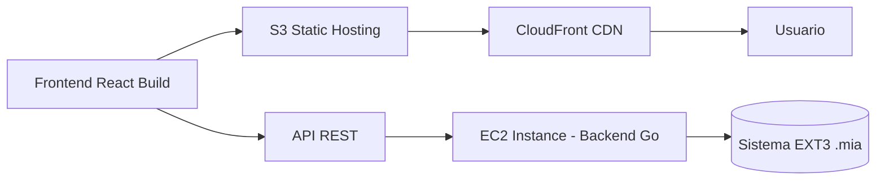

# Universidad de San Carlos de Guatemala

## Facultad de Ingeniería

### Escuela de Ciencias y Sistemas

#### Laboratorio de Manejo e Implementación de Archivos

---

# **Manual Técnico – GoDisk 2.0**

### Sistema de Archivos EXT2 / EXT3 con Despliegue AWS

**Autor:** Julian Reyes
**Carnet:** 201905884
**Segundo Semestre 2025**

---

## 📘 Índice

1. [Introducción](#introducción)
2. [Objetivos](#objetivos)

   * [Objetivo General](#objetivo-general)
   * [Objetivos Específicos](#objetivos-específicos)
3. [Arquitectura del Sistema](#arquitectura-del-sistema)
4. [Estructuras de Datos](#estructuras-de-datos)
5. [Comandos Implementados](#comandos-implementados)
6. [Despliegue en AWS](#despliegue-en-aws)
7. [Conclusiones](#conclusiones)

---

## 🔹 Introducción

El presente **Manual Técnico** documenta el desarrollo del proyecto **GoDisk 2.0**, el cual consiste en la simulación de un sistema de archivos **EXT2 / EXT3**, implementado en **Go (Golang)** para el backend y **React + TypeScript** para el frontend.
El proyecto fue desarrollado como parte del curso **Manejo e Implementación de Archivos** en la Facultad de Ingeniería de la **Universidad de San Carlos de Guatemala**.

Este sistema permite simular la creación, formateo, montaje y manipulación de discos virtuales en archivos `.mia`, integrando comandos reales que operan sobre estructuras como el **MBR**, **EBR**, **SuperBloque**, **Inodos** y **Bloques**.
Para el Proyecto 2, se extendió la funcionalidad con soporte **EXT3 (journaling)** y despliegue en la nube mediante **AWS S3**.

---

## 🎯 Objetivos

### Objetivo General

Desarrollar una aplicación web funcional que simule un sistema de archivos EXT2/EXT3, con capacidad para crear, montar y administrar discos, particiones, usuarios y archivos, integrando un backend robusto en Go y un frontend interactivo en React.

### Objetivos Específicos

* Implementar estructuras de datos reales de sistemas de archivos EXT2/EXT3.
* Integrar una interfaz web que permita ejecutar comandos y scripts `.smia`.
* Generar reportes visuales mediante **Graphviz** y **Mermaid**.
* Desplegar la aplicación en un entorno web mediante **AWS S3 y EC2**.

---

## 🧩 Arquitectura del Sistema

La arquitectura de GoDisk 2.0 se compone de tres niveles principales:

1. **Frontend (React + Vite)**
2. **Backend (Go – API RESTful)**
3. **Infraestructura (AWS S3 + EC2)**

```mermaid
graph TD
    A[Usuario] --> B[Frontend React/Vite]
    B --> |HTTP REST API| C[Backend Go (Gin Framework)]
    C --> D[(Sistema EXT3 Simulado .mia)]
    C --> E[Graphviz & Reportes]
    B --> F[(AWS S3 Static Hosting)]
    F --> G[Despliegue Web Público]
```

📌 El frontend se comunica con el backend mediante peticiones REST (`/api/*`), mientras que el backend se encarga de procesar los comandos, actualizar las estructuras del sistema de archivos y generar los reportes visuales.

---

## 🧱 Estructuras de Datos

### 1. **MBR (Master Boot Record)**

Guarda información del tamaño del disco, fecha de creación, tipo de ajuste y particiones.

| Campo              | Tipo         | Descripción                 |
| ------------------ | ------------ | --------------------------- |
| mbr_tamano         | int          | Tamaño total del disco      |
| mbr_fecha_creacion | time         | Fecha de creación           |
| dsk_fit            | char         | Tipo de ajuste (BF, FF, WF) |
| mbr_partitions     | [4]Partition | Información de particiones  |

### 2. **EBR (Extended Boot Record)**

Estructura enlazada que administra las particiones lógicas dentro de una partición extendida.

### 3. **SuperBloque**

Contiene información global del sistema de archivos (EXT2/EXT3):

* Cantidad de inodos y bloques
* Bitmaps de inodos y bloques
* Dirección de estructuras
* Fecha de montaje/desmontaje

### 4. **Inodo**

Define permisos, tipo (archivo o carpeta), tamaño y apuntadores directos/indirectos.

### 5. **Bloques**

* **Bloque Carpeta:** Contiene referencias a archivos o carpetas.
* **Bloque Archivo:** Contiene contenido textual.
* **Bloque de Apuntadores:** Extiende la capacidad de almacenamiento.

### 6. **Bitmaps**

Mapas de bits para marcar inodos o bloques ocupados/libres.

---

## 💻 Comandos Implementados

A continuación, se resumen los comandos principales implementados en GoDisk 2.0:

| Comando  | Función                                 | Ejemplo                                                                |
| -------- | --------------------------------------- | ---------------------------------------------------------------------- |
| `mkdisk` | Crea un disco virtual `.mia`            | `mkdisk -size=5 -unit=M -path="/home/Disco1.mia"`                      |
| `fdisk`  | Crea o elimina particiones              | `fdisk -type=P -unit=K -name=Part1 -size=100 -path="/home/Disco1.mia"` |
| `mount`  | Monta una partición en memoria          | `mount -path="/home/Disco1.mia" -name=Part1`                           |
| `mkfs`   | Formatea la partición en EXT2 o EXT3    | `mkfs -id=841A -type=full`                                             |
| `login`  | Inicia sesión como usuario root o común | `login -user=root -pass=123 -id=841A`                                  |
| `rep`    | Genera reportes gráficos con Graphviz   | `rep -id=841A -path=/home/reports -name=mbr`                           |

Los comandos siguen la estructura de ejecución definida por el enunciado del curso y se comunican con el backend mediante la capa REST.

---

## ☁️ Despliegue en AWS

El proyecto se desplegó mediante los siguientes componentes:



1. **Frontend:** compilado con Vite y alojado en AWS S3.
2. **Backend:** desplegado en una instancia EC2, expone endpoints `/api/*`.
3. **Graphviz y reportes:** se ejecutan en el backend y se almacenan temporalmente.

---

## 🧾 Conclusiones

* Se logró implementar exitosamente un sistema de archivos **EXT2/EXT3 funcional** con simulación completa en disco binario.
* La integración entre **Go (backend)** y **React (frontend)** permitió una interfaz robusta, modular y escalable.
* La migración del entorno local a la **infraestructura AWS** facilitó la disponibilidad web y la accesibilidad del proyecto.
* Se documentaron de forma técnica y formal las estructuras, comandos y reportes requeridos conforme a los estándares del curso MIA.

---

## 📚 Referencias

* Audesirk, T., Byers, B. (2013). *La vida en la Tierra con Fisiología.* Pearson.
* Documentación oficial de Go (golang.org).
* AWS Documentation – S3, EC2 y CloudFront.
* Manual del curso MIA 2S2025 – USAC.

---
