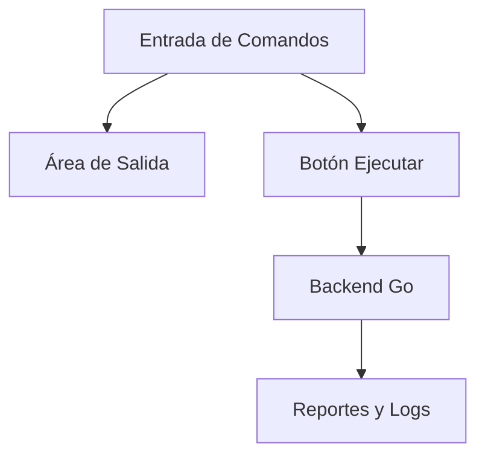

# Universidad de San Carlos de Guatemala

## Facultad de Ingeniería

### Escuela de Ciencias y Sistemas

#### Laboratorio de Manejo e Implementación de Archivos

---

# **Manual de Usuario – GoDisk 2.0**

### Sistema de Archivos EXT2 / EXT3 con Despliegue AWS

**Autor:** Julian Reyes
**Carnet:** 201905884
**Segundo Semestre 2025**

---

## 📘 Índice

- [Universidad de San Carlos de Guatemala](#universidad-de-san-carlos-de-guatemala)
  - [Facultad de Ingeniería](#facultad-de-ingeniería)
    - [Escuela de Ciencias y Sistemas](#escuela-de-ciencias-y-sistemas)
      - [Laboratorio de Manejo e Implementación de Archivos](#laboratorio-de-manejo-e-implementación-de-archivos)
- [**Manual de Usuario – GoDisk 2.0**](#manual-de-usuario--godisk-20)
    - [Sistema de Archivos EXT2 / EXT3 con Despliegue AWS](#sistema-de-archivos-ext2--ext3-con-despliegue-aws)
  - [📘 Índice](#-índice)
  - [🔹 Introducción](#-introducción)
  - [⚙️ Requisitos del Sistema](#️-requisitos-del-sistema)
  - [🚀 Instalación y Ejecución](#-instalación-y-ejecución)
    - [🔧 Instalación Local](#-instalación-local)
    - [☁️ Despliegue AWS (Producción)](#️-despliegue-aws-producción)
  - [🖥️ Interfaz del Sistema](#️-interfaz-del-sistema)
  - [🧩 Uso de Comandos](#-uso-de-comandos)
    - [1️⃣ MKDISK](#1️⃣-mkdisk)
    - [2️⃣ FDISK](#2️⃣-fdisk)
    - [3️⃣ MOUNT](#3️⃣-mount)
    - [4️⃣ MKFS](#4️⃣-mkfs)
    - [5️⃣ LOGIN y LOGOUT](#5️⃣-login-y-logout)
    - [6️⃣ Usuarios y Grupos (MKGRP, RMGRP, MKUSR, RMUSR, CHGRP)](#6️⃣-usuarios-y-grupos-mkgrp-rmgrp-mkusr-rmusr-chgrp)
    - [7️⃣ MKDIR y MKFILE](#7️⃣-mkdir-y-mkfile)
    - [8️⃣ REP (Reportes)](#8️⃣-rep-reportes)
  - [🧠 Ejemplo de Ejecución Completa](#-ejemplo-de-ejecución-completa)
  - [⚠️ Solución de Problemas Comunes](#️-solución-de-problemas-comunes)
  - [🧾 Conclusiones](#-conclusiones)
  - [📚 Referencias](#-referencias)

---

## 🔹 Introducción

El presente **Manual de Usuario** explica el uso funcional del sistema **GoDisk 2.0**, el cual permite simular operaciones sobre un sistema de archivos tipo **EXT2/EXT3**, mediante comandos que gestionan discos, particiones, usuarios y archivos.

El sistema cuenta con una **interfaz web** que permite al usuario ingresar comandos directamente o cargar archivos `.smia` con secuencias de instrucciones para ejecutar operaciones automatizadas.

Este manual guía paso a paso la interacción del usuario con la interfaz, los comandos y la interpretación de resultados.

---

## ⚙️ Requisitos del Sistema

| Requisito                    | Descripción                                          |
| ---------------------------- | ---------------------------------------------------- |
| **Sistema Operativo**        | Linux, macOS o Windows con WSL                       |
| **Backend**                  | Go 1.21+                                             |
| **Frontend**                 | Node.js 18+                                          |
| **Herramientas Adicionales** | Graphviz instalado localmente                        |
| **Navegador Recomendado**    | Mozilla Firefox o Google Chrome                      |
| **Conectividad**             | Acceso a Internet para despliegue en AWS (si aplica) |

---

## 🚀 Instalación y Ejecución

### 🔧 Instalación Local

1. Clonar el repositorio:

   ```bash
   git clone https://github.com/Santiago78op/MIA_2S2025_P1_201905884.git
   ```
2. Ingresar a las carpetas de frontend y backend.

   ```bash
   cd Backend/cmd/server
   go run .
   ```
3. Ejecutar el frontend:

   ```bash
   cd Frontend
   npm install
   npm run dev
   ```
4. Abrir el navegador en `http://localhost:5173`.

### ☁️ Despliegue AWS (Producción)

* **Frontend**: alojado en S3 con hosting estático.
* **Backend**: desplegado en EC2 con IP pública y API `/api/*`.
* Acceder desde:
  `https://frontend-mia-201905884.s3-website.us-east-2.amazonaws.com`

---

## 🖥️ Interfaz del Sistema

La interfaz se divide en tres secciones principales:



| Elemento                | Descripción                                                     |
| ----------------------- | --------------------------------------------------------------- |
| **Área de Entrada**     | Campo de texto para ingresar comandos o cargar scripts `.smia`. |
| **Botón Ejecutar**      | Envia los comandos al backend y espera respuesta.               |
| **Área de Salida**      | Muestra resultados, errores y logs de ejecución.                |
| **Botón Cargar Script** | Permite cargar un archivo `.smia` con múltiples comandos.       |

---

## 🧩 Uso de Comandos

Los comandos no distinguen mayúsculas y minúsculas.
Cada comando tiene parámetros **obligatorios** y **opcionales**, y debe ingresarse con el formato `comando -parametro=valor`.

---

### 1️⃣ MKDISK

Crea un disco virtual `.mia` con tamaño definido.

```bash
mkdisk -size=10 -unit=M -path="/home/usuario/Disco1.mia"
```

**Parámetros:**

| Parámetro | Tipo        | Descripción                              |
| --------- | ----------- | ---------------------------------------- |
| `-size`   | Obligatorio | Tamaño del disco (entero positivo).      |
| `-unit`   | Opcional    | M=MB, K=KB (por defecto M).              |
| `-path`   | Obligatorio | Ruta donde se crea el archivo del disco. |

---

### 2️⃣ FDISK

Administra las particiones del disco.

```bash
fdisk -type=P -unit=K -name=Part1 -size=100 -path="/home/usuario/Disco1.mia"
```

**Parámetros:**

* `-type` → tipo de partición (P=Primaria, E=Extendida, L=Lógica).
* `-fit` → tipo de ajuste (BF, FF, WF).
* `-name` → nombre de la partición.

---

### 3️⃣ MOUNT

Monta una partición en memoria.

```bash
mount -path="/home/usuario/Disco1.mia" -name=Part1
```

Muestra un ID generado (por ejemplo `841A`), que se usará en otros comandos.

---

### 4️⃣ MKFS

Formatea la partición seleccionada.

```bash
mkfs -id=841A -type=full
```

Crea las estructuras del sistema EXT2 o EXT3, incluyendo el archivo `users.txt` inicial con usuario `root`.

---

### 5️⃣ LOGIN y LOGOUT

```bash
login -user=root -pass=123 -id=841A
logout
```

* **LOGIN**: inicia sesión en la partición formateada.
* **LOGOUT**: cierra la sesión actual.

Solo un usuario puede estar logueado a la vez.

---

### 6️⃣ Usuarios y Grupos (MKGRP, RMGRP, MKUSR, RMUSR, CHGRP)

Ejemplo completo:

```bash
mkgrp -name=usuarios
mkusr -user=julio -pass=1234 -grp=usuarios
chgrp -user=julio -grp=admin
rmusr -user=julio
```

Estos comandos manipulan el archivo lógico `users.txt` dentro del sistema de archivos.

---

### 7️⃣ MKDIR y MKFILE

Permiten crear carpetas y archivos.

```bash
mkdir -p -path=/home/user/docs
mkfile -size=15 -path="/home/user/docs/archivo.txt" -r
```

* `-p` crea carpetas padre automáticamente.
* `-r` crea rutas si no existen.
* `-size` define el tamaño del archivo en bytes.

---

### 8️⃣ REP (Reportes)

Genera reportes visuales con Graphviz.
Los reportes pueden ser de tipo `mbr`, `disk`, `inode`, `block`, `sb`, `tree`, `ls`, etc.

```bash
rep -id=841A -path="/home/usuario/reports/reporte1.jpg" -name=mbr
rep -id=841A -path="/home/usuario/reports/reporte2.jpg" -name=disk
```

El sistema genera un archivo de imagen o texto según el tipo de reporte solicitado.

---

## 🧠 Ejemplo de Ejecución Completa

```bash
# 1. Crear disco
mkdisk -size=10 -unit=M -path="/home/julian/Disco1.mia"

# 2. Crear partición
fdisk -type=P -unit=K -name=Part1 -size=100 -path="/home/julian/Disco1.mia"

# 3. Montar partición
mount -path="/home/julian/Disco1.mia" -name=Part1

# 4. Formatear partición
mkfs -id=841A -type=full

# 5. Iniciar sesión
login -user=root -pass=123 -id=841A

# 6. Crear grupo y usuario
mkgrp -name=usuarios
mkusr -user=alex -pass=321 -grp=usuarios

# 7. Crear carpeta y archivo
mkdir -p -path=/home/user/docs
mkfile -size=20 -path="/home/user/docs/info.txt" -r

# 8. Generar reporte
rep -id=841A -path="/home/user/reports/report_mbr.jpg" -name=mbr
```

---

## ⚠️ Solución de Problemas Comunes

| Error                                | Posible Causa                  | Solución                                            |
| ------------------------------------ | ------------------------------ | --------------------------------------------------- |
| **“No se encontró el archivo .mia”** | Ruta incorrecta en `-path`     | Verificar la ubicación o crear nuevamente el disco. |
| **“La partición ya existe”**         | Nombre duplicado               | Cambiar el valor de `-name`.                        |
| **“No hay sesión activa”**           | Se ejecutó comando sin `login` | Iniciar sesión antes de usar comandos de usuario.   |
| **“Error de permisos”**              | Usuario sin privilegios        | Iniciar sesión como `root`.                         |
| **“Reporte no generado”**            | Graphviz no instalado          | Instalar con `sudo apt install graphviz`.           |

---

## 🧾 Conclusiones

* La aplicación GoDisk 2.0 permite al usuario experimentar de forma interactiva con un sistema de archivos simulado EXT2/EXT3.
* La interfaz web facilita la ejecución de comandos sin necesidad de consola.
* El uso de **scripts .smia** permite automatizar pruebas y validaciones.
* El despliegue en **AWS S3 + EC2** amplía el alcance del proyecto, haciéndolo accesible desde cualquier navegador.

---

## 📚 Referencias

* Documentación del curso MIA 2S2025 — USAC.
* Sitio oficial de Go: [https://go.dev](https://go.dev)
* AWS Docs: [https://docs.aws.amazon.com](https://docs.aws.amazon.com)
* Graphviz Documentation: [https://graphviz.org](https://graphviz.org)
