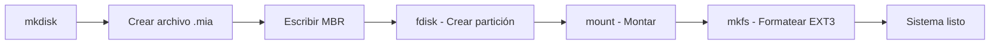
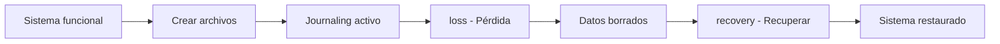

# Manual Técnico - GoDisk 2.0 (EXT3)

**Proyecto:** MIA_2S2025_P2_201905884
**Curso:** Manejo e Implementación de Archivos
**Universidad:** USAC – Facultad de Ingeniería
**Versión:** Proyecto 2 - EXT3
**Fecha:** Octubre 2025

---

## 1. Introducción

GoDisk 2.0 es un simulador completo de sistema de archivos que implementa los formatos **EXT2** y **EXT3**, incluyendo gestión de discos, particiones, journaling, recuperación de datos y generación de reportes visuales.

### 1.1 Objetivos del Proyecto

- Implementar sistema de archivos EXT3 con journaling completo
- Simular pérdida y recuperación de datos
- Generar reportes visuales en formato DOT/GraphViz
- Proporcionar interfaz web para visualización y gestión
- Implementar comandos de administración compatibles con sistemas UNIX

---

## 2. Arquitectura del Sistema

### 2.1 Componentes Principales

```
GoDisk 2.0
├── Backend (Go)
│   ├── Gestor de Discos (MBR/EBR)
│   ├── Sistema EXT2
│   ├── Sistema EXT3 + Journaling
│   ├── Generador de Reportes
│   └── API REST
└── Frontend (React + TypeScript)
    ├── Terminal Interactiva
    ├── Explorador de Archivos
    ├── Visualizador de Reportes
    └── Panel de Journaling
```

### 2.2 Stack Tecnológico

| Componente | Tecnología |
|------------|------------|
| Backend | Go 1.21+ |
| Frontend | React 18 + TypeScript |
| Estilos | TailwindCSS |
| Reportes | GraphViz (DOT) |
| Logging | Sistema centralizado JSON |
| Deploy | Local / AWS (EC2 + S3) |

---

## 3. Estructuras del Disco

### 3.1 Master Boot Record (MBR)

```go
type MBR struct {
    MbrSize           int32      // Tamaño total del disco
    MbrCreationDate   int64      // Timestamp de creación
    MbrSignature      int32      // Firma única del disco
    MbrDiskFit        byte       // Algoritmo de ajuste (FF/BF/WF)
    Parts             [4]Partition // Particiones primarias/extendidas
}
```

**Tamaño:** 512 bytes
**Ubicación:** Offset 0 del disco

### 3.2 Extended Boot Record (EBR)

```go
type EBR struct {
    PartMount byte       // Estado de montaje
    PartFit   byte       // Algoritmo de ajuste
    PartStart int32      // Inicio de la partición
    PartSize  int32      // Tamaño de la partición
    PartNext  int32      // Siguiente EBR en la cadena
    PartName  [16]byte   // Nombre de la partición
}
```

**Tamaño:** 512 bytes
**Ubicación:** Al inicio de cada partición lógica

---

## 4. Sistema de Archivos EXT2

### 4.1 SuperBlock EXT2

```go
type Superblock struct {
    S_filesystem_type   int32   // Tipo de FS (2=EXT2)
    S_inodes_count      int32   // Total de inodos
    S_blocks_count      int32   // Total de bloques
    S_free_blocks_count int32   // Bloques libres
    S_free_inodes_count int32   // Inodos libres
    S_mtime             int64   // Última fecha de montaje
    S_umtime            int64   // Última fecha de desmontaje
    S_mnt_count         int32   // Contador de montajes
    S_magic             int32   // 0xEF53
    S_inode_size        int32   // Tamaño de inodo (128)
    S_block_size        int32   // Tamaño de bloque (64)
    S_first_ino         int32   // Primer inodo libre
    S_first_blo         int32   // Primer bloque libre
    S_bm_inode_start    int32   // Inicio bitmap inodos
    S_bm_block_start    int32   // Inicio bitmap bloques
    S_inode_start       int32   // Inicio tabla inodos
    S_block_start       int32   // Inicio bloques
}
```

### 4.2 Inodo EXT2

```go
type Inode struct {
    IUid   int32      // ID del usuario propietario
    IGid   int32      // ID del grupo
    IS     int32      // Tamaño del archivo
    IAtime int64      // Último acceso
    ICtime int64      // Creación
    IMtime int64      // Última modificación
    IBlock [15]int32  // Apuntadores a bloques
    IType  byte       // 0=carpeta, 1=archivo
    IPerm  [3]byte    // Permisos UGO (octal)
}
```

**Tamaño:** 128 bytes
**IBlock[0-11]:** Apuntadores directos
**IBlock[12]:** Apuntador indirecto simple
**IBlock[13]:** Apuntador indirecto doble
**IBlock[14]:** Apuntador indirecto triple

### 4.3 Bloques de Datos

**FolderBlock (Carpetas):**
```go
type FolderBlock struct {
    BContent [4]Content // 4 entradas por bloque
}

type Content struct {
    BName  [12]byte // Nombre de archivo/carpeta
    BInodo int32    // Número de inodo
}
```

**FileBlock (Archivos):**
```go
type FileBlock struct {
    BContent [64]byte // Contenido del archivo
}
```

---

## 5. Sistema de Archivos EXT3

### 5.1 Diferencias con EXT2

| Característica | EXT2 | EXT3 |
|----------------|------|------|
| Journaling | ❌ No | ✅ Sí (50 entradas) |
| Recuperación | ❌ No | ✅ Desde journal |
| Integridad | Básica | Alta |
| Complejidad | Media | Alta |

### 5.2 SuperBlock EXT3

Extiende el SuperBlock EXT2 con:

```go
type SuperBlock struct {
    // ... campos de EXT2 ...
    SJournalStart  int64 // Offset del journal
    SJournalCount  int32 // Cantidad de entradas (50)
    SFsType        int32 // 3 para EXT3
}
```

### 5.3 Cálculo de Estructuras (n)

**Fórmula según enunciado:**

```
n = floor((partSize - 512 - 3200) / (1 + 3 + 128 + 3*blockSize))

Donde:
- 512: Tamaño del SuperBlock
- 3200: Tamaño del Journal (50 * 64)
- 1: Bitmap de inodos (1 byte por inodo)
- 3: Bitmap de bloques (3 bytes, 3 bloques por inodo)
- 128: Tamaño de inodo
- 3*blockSize: Bloques de datos (3 por inodo)
```

**Ejemplo con partición de 10MB y blockSize=64:**
```
n = floor((10485760 - 512 - 3200) / (1 + 3 + 128 + 192))
n = floor(10481248 / 324)
n = 32348 inodos
```

### 5.4 Layout de Partición EXT3

```
┌─────────────────────────────────────────────────────────────┐
│ SuperBlock (512 bytes)                                      │
├─────────────────────────────────────────────────────────────┤
│ Journal (50 * 64 = 3200 bytes)                             │
├─────────────────────────────────────────────────────────────┤
│ Bitmap de Inodos (n bytes)                                 │
├─────────────────────────────────────────────────────────────┤
│ Bitmap de Bloques (3n bytes)                              │
├─────────────────────────────────────────────────────────────┤
│ Tabla de Inodos (n * 128 bytes)                           │
├─────────────────────────────────────────────────────────────┤
│ Bloques de Datos (3n * blockSize bytes)                   │
└─────────────────────────────────────────────────────────────┘
```

---

## 6. Journaling (EXT3)

### 6.1 Estructura Journal

```go
type Journal struct {
    Entries [50]JournalEntry // Array fijo de 50 entradas
    Current int32            // Índice circular actual
}
```

**Funcionamiento:**
- Buffer circular de 50 entradas
- Se sobrescriben las entradas más antiguas
- Persiste en disco entre montajes

### 6.2 Entrada de Journal

```go
type JournalEntry struct {
    Operation   [16]byte // mkdir, mkfile, edit, remove, rename, copy, move, chown, chmod
    Path        [24]byte // Ruta del archivo/directorio
    Content     [8]byte  // Información adicional
    Timestamp   int64    // Unix timestamp
    UserID      int32    // ID del usuario
    GroupID     int32    // ID del grupo
    Permissions uint16   // Permisos (chmod)
}
```

**Tamaño:** 64 bytes

### 6.3 Operaciones Registradas

| Operación | Descripción | Campos importantes |
|-----------|-------------|-------------------|
| `mkfile` | Crear archivo | Path, Content |
| `mkdir` | Crear directorio | Path |
| `edit` | Editar archivo | Path, Content |
| `remove` | Eliminar | Path |
| `rename` | Renombrar | Path (old→new) |
| `copy` | Copiar | Path (src→dst) |
| `move` | Mover | Path (src→dst) |
| `chown` | Cambiar propietario | UserID, GroupID |
| `chmod` | Cambiar permisos | Permissions |

---

## 7. Recuperación de Datos

### 7.1 Comando LOSS

Simula pérdida completa de datos:

**Áreas limpiadas (escritas con ceros):**
- ✅ Bitmap de Inodos
- ✅ Bitmap de Bloques
- ✅ Tabla de Inodos
- ✅ Bloques de Datos

**Áreas preservadas:**
- ✅ SuperBlock
- ✅ Journal

**Implementación:**
```go
func (e *FS3) Loss(ctx context.Context, h fs.MountHandle) error {
    // Leer SuperBlock para obtener offsets
    sb := DeserializeSuperBlock(...)

    // Limpiar bitmaps
    writeZeros(bmInodeStart, n)
    writeZeros(bmBlockStart, 3*n)

    // Limpiar tabla de inodos
    writeZeros(inodeStart, n*128)

    // Limpiar bloques de datos
    writeZeros(blockStart, 3*n*blockSize)

    // Journal permanece intacto para recovery
}
```

### 7.2 Comando RECOVERY

Reconstruye el sistema de archivos desde el journal:

**Proceso:**
1. Leer journal completo
2. Ordenar entradas por timestamp
3. Reproducir operaciones en orden
4. Reconstruir estructura de directorios
5. Recrear archivos con contenido
6. Restaurar permisos y propietarios

**Implementación (pseudocódigo):**
```go
func (e *FS3) Recovery(ctx context.Context, h fs.MountHandle) error {
    // Leer journal
    entries := readJournal()

    // Ordenar por timestamp
    sort(entries, byTimestamp)

    // Reproducir operaciones
    for _, entry := range entries {
        switch entry.Operation {
        case "mkdir":
            recreateDirectory(entry.Path)
        case "mkfile":
            recreateFile(entry.Path, entry.Content)
        case "edit":
            appendToFile(entry.Path, entry.Content)
        // ... más operaciones
        }
    }

    return nil
}
```

---

## 8. Comandos Implementados

### 8.1 Gestión de Discos

| Comando | Descripción | Ejemplo |
|---------|-------------|---------|
| `mkdisk` | Crear disco virtual | `mkdisk -size=10 -unit=M -path=/tmp/disk.mia` |
| `rmdisk` | Eliminar disco | `rmdisk -path=/tmp/disk.mia` |
| `fdisk` | Crear/eliminar particiones | `fdisk -size=5 -unit=M -path=/tmp/disk.mia -name=P1` |

### 8.2 Montaje

| Comando | Descripción | Ejemplo |
|---------|-------------|---------|
| `mount` | Montar partición | `mount -path=/tmp/disk.mia -name=P1` |
| `unmount` | Desmontar | `unmount -id=vd12ab34` |
| `mkfs` | Formatear | `mkfs -id=vd12ab34 -type=3fs` |

### 8.3 Archivos y Directorios

| Comando | Descripción | Ejemplo |
|---------|-------------|---------|
| `mkdir` | Crear directorio | `mkdir -path=/home/user -id=vd12ab34` |
| `mkfile` | Crear archivo | `mkfile -path=/file.txt -cont="Hello" -id=vd12ab34` |
| `remove` | Eliminar | `remove -path=/file.txt -id=vd12ab34` |
| `edit` | Editar archivo | `edit -path=/file.txt -cont="New" -id=vd12ab34` |
| `rename` | Renombrar | `rename -path=/old.txt -name=new.txt -id=vd12ab34` |
| `copy` | Copiar | `copy -path=/src.txt -dest=/dst.txt -id=vd12ab34` |
| `move` | Mover | `move -path=/file.txt -dest=/dir/ -id=vd12ab34` |
| `find` | Buscar | `find -path=/home -name="*.txt" -id=vd12ab34` |
| `chown` | Cambiar propietario | `chown -path=/file.txt -user=root -id=vd12ab34` |
| `chmod` | Cambiar permisos | `chmod -path=/file.txt -perm=755 -id=vd12ab34` |

### 8.4 EXT3 Específicos

| Comando | Descripción | Ejemplo |
|---------|-------------|---------|
| `journaling` | Mostrar journal | `journaling -id=vd12ab34` |
| `recovery` | Recuperar datos | `recovery -id=vd12ab34` |
| `loss` | Simular pérdida | `loss -id=vd12ab34` |

### 8.5 Reportes

| Comando | Descripción | Ejemplo |
|---------|-------------|---------|
| `rep` | Generar reporte | `rep -id=vd12ab34 -path=/report.dot -name=mbr` |

**Tipos de reportes:**
- `mbr`: Estructura del MBR
- `disk`: Uso del disco
- `sb`: SuperBlock
- `tree`: Árbol de directorios
- `journal`: Entradas del journal

---

## 9. API REST

### 9.1 Endpoints Principales

**Comandos:**
```
POST /api/cmd/run
POST /api/cmd/execute
POST /api/cmd/script
```

**Discos:**
```
GET  /api/disks
GET  /api/disks/info?path=...
GET  /api/mounted
```

**Reportes:**
```
POST /api/reports/mbr
POST /api/reports/disk
POST /api/reports/sb
POST /api/reports/tree
POST /api/reports/journal
POST /api/reports/generate
```

**EXT3:**
```
GET  /api/ext3/journal?id=vd12ab34
POST /api/ext3/recovery {id: "vd12ab34"}
POST /api/ext3/loss {id: "vd12ab34"}
```

**Logs:**
```
GET  /api/logs
POST /api/logs/clear
GET  /api/logs/stats
```

### 9.2 Formato de Respuesta

```json
{
  "ok": true,
  "output": "Resultado de la operación",
  "error": null,
  "command": "mkdisk -size=10 -unit=M -path=/tmp/test.mia"
}
```

---

## 10. Sistema de Logging

### 10.1 Niveles de Log

| Nivel | Color | Uso |
|-------|-------|-----|
| `INFO` | Azul | Operaciones normales |
| `WARN` | Amarillo | Advertencias |
| `ERROR` | Rojo | Errores |
| `DEBUG` | Gris | Depuración |

### 10.2 Formato de Log

```json
{
  "timestamp": "2025-10-06T12:34:56Z",
  "level": "INFO",
  "message": "Disco creado exitosamente",
  "metadata": {
    "path": "/tmp/disk.mia",
    "size": 10485760
  }
}
```

### 10.3 Ubicación

- **Archivo:** `Backend/cmd/server/Logs/server.log`
- **API:** `/api/logs` (últimas 100 entradas)

---

## 11. Flujo de Operaciones

### 11.1 Crear y Formatear Disco



### 11.2 Simular Pérdida y Recuperación



---

## 12. Compilación y Ejecución

### 12.1 Backend

```bash
cd Backend
go mod download
go build -o godisk cmd/server/main.go
./godisk
```

**Puerto:** 8080
**Health:** http://localhost:8080/healthz

### 12.2 Frontend

```bash
cd Frontend/godisk-frontend
npm install
npm run dev
```

**Puerto:** 5173
**URL:** http://localhost:5173

### 12.3 Variables de Entorno

```bash
# Backend
export PORT=8080
export CORS_ORIGIN=http://localhost:5173

# Frontend
export VITE_API_URL=http://localhost:8080
```

---

## 13. Pruebas y Validación

### 13.1 Script de Prueba EXT3

```bash
# Crear disco
mkdisk -size=10 -unit=M -path=/tmp/test.mia

# Crear partición
fdisk -size=8 -unit=M -path=/tmp/test.mia -name=P1 -type=P

# Montar y formatear
mount -path=/tmp/test.mia -name=P1
mkfs -id=vd12ab34 -type=3fs

# Crear estructura
mkdir -path=/home -id=vd12ab34
mkfile -path=/home/test.txt -cont="Hello World" -id=vd12ab34

# Verificar journal
journaling -id=vd12ab34

# Simular pérdida
loss -id=vd12ab34

# Recuperar
recovery -id=vd12ab34
```

### 13.2 Validación de Integridad

```bash
# Verificar SuperBlock
rep -id=vd12ab34 -name=sb -path=/tmp/sb.dot

# Verificar estructura
rep -id=vd12ab34 -name=tree -path=/tmp/tree.dot

# Visualizar con GraphViz
dot -Tpng /tmp/tree.dot -o tree.png
```

---

## 14. Solución de Problemas

### 14.1 Errores Comunes

| Error | Causa | Solución |
|-------|-------|----------|
| `partition not found` | ID incorrecto | Verificar con `/api/mounted` |
| `disk not formatted` | Sin mkfs | Ejecutar `mkfs -type=3fs` |
| `insufficient space` | Partición llena | Crear partición más grande |
| `journal full` | 50 operaciones excedidas | Ejecutar `recovery` |

### 14.2 Logs de Depuración

```bash
# Ver logs del servidor
tail -f Backend/cmd/server/Logs/server.log

# Logs en tiempo real (API)
curl http://localhost:8080/api/logs
```

---

## 15. Referencias

- **Enunciado del Proyecto:** Proyecto 2 - GoDisk 2.0
- **EXT2 Specification:** https://www.nongnu.org/ext2-doc/
- **EXT3 Journaling:** https://en.wikipedia.org/wiki/Ext3
- **GraphViz DOT:** https://graphviz.org/doc/info/lang.html

---

**Última actualización:** Octubre 2025
**Autor:** Julian - 201905884
**Versión del documento:** 1.0
